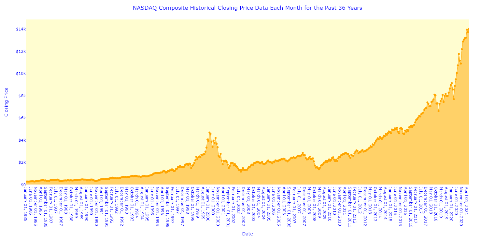

# Graphing the Historical Performance of the NASDAQ Composite Historical Data Project

## Project Description

Using a `.csv` file of the NASDAQ Composite historical data, plot the closing prices to find out how this stock index has performed over the years.

## Goals/Purposes

1. Create a visualization that shows the historical performance of this stock index over the years to make a good decision on investing

2. See impacts of major events

## Final Visualization

My visualization is an area graph made using Plotly Express. There are points laid on top of the line that show where exactly the plots are on the graph and make it easier to see what the exact closing price of the NASDAQ Composite was at a specific date.

## What My Visualization Shows

I think this ended up being a useful visualization even though it was not very fancy with different features. This visualization helps users see that even though there have been times where the price of this stock index has fallen, it has generally rebounded, and the price has consistently increased over the past 36 years. If someone looked at this graph and saw this, they could see that the NASDAQ composite index might be a good spot to invest some money in if they were looking to build wealth.

## What Story it Tells

The main story it tells is the impact of major events that have happened over the years, such as the Great Recession and the coronavirus pandemic. It is easy to hover over the "valleys" of the graph and see when the stock index was down and if it was tied to any major events such as the aforementioned ones.

## The Code

The final executable code is named `project1.py`, and it is also located in this Project1 folder.

## Sources Used

* [Yahoo Finance Data Download Instructions](https://www.macroption.com/yahoo-finance-download-historical-data/)
* [Article on Stock Price Analysis Charts](https://school.stockcharts.com/doku.php?id=chart_analysis:what_are_charts)
* [Converting Dates to the Written out Version from Numeric](https://www.programiz.com/python-programming/datetime/strftime)
* [How to Return Date as Words Stack Overflow](https://stackoverflow.com/questions/27214378/python-how-to-return-date-as-words)
* [Python | Convert Two Lists Into a Dictionary](https://www.geeksforgeeks.org/python-convert-two-lists-into-a-dictionary/)
* [Plotly Area Chart Code Example](https://medium.com/codex/financial-charts-and-visuals-with-plotly-in-python-843ffa9341a9)
* [Styling Reference 1](https://plotly.com/python/styling-plotly-express/)
* [Styling Reference 2 for Setting Labels](https://plotly.com/python/figure-labels/)
* [How to Change the Color of the Line of the Graph Example](https://plotly.com/python/line-charts/#style-line-plots) 
* [Reference for Changing Background Color of Plot](https://medium.com/analytics-vidhyaan-intro-to-customizing-charts-in-plotly-express-e3c473740f66)