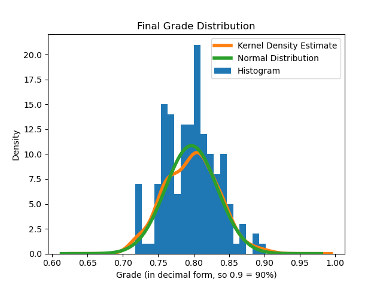

# Project 2

## Project Description

This project analyzes student data from two files:
- id-hw-exams.csv - contains student names, id numbers, and grades for homework assignments and exams for the class
- id-section.csv - contains student names, id numbers, university id numbers, email addresses, and the section in which each student was enrolled

This program reads the data from the files and generates a report with grade statistics for assignments in the class. More specifically, it calculates:
- grades students earned for each assignment
- average grades for each homework assignment
- average grades for each exam
- lowest and highest scores for homework assignments and exams
- standard deviation values for each homework assignment and exam
- final grades for each student in numeric form as well as in letter grade form
- final grade distribution for each section (how many students earned which letter grades)
- correlation between homework grades and final grades
- correlation between exam grades and final grades

## Instructor Report

## Homework 1:
- Lowest Score:  0.0
- Highest Score:  100.0
- Average Score:  77.525
- Standard Deviation from Average:  13.725550257303789

## Homework 2:
- Lowest Score:  60.0
- Highest Score:  100.0
- Average Score:  80.65833333333333
- Standard Deviation from Average:  12.500584438238848

## Homework 3:
- Lowest Score:  60.0
- Highest Score:  100.0
- Average Score:  78.96666666666667
- Standard Deviation from Average:  11.657646720901747

## Homework 4:
- Lowest Score:  60.0
- Highest Score:  100.0
- Average Score:  78.68666666666667
- Standard Deviation from Average:  10.9710642400491

## Homework 5:
- Lowest Score:  60.0
- Highest Score:  100.0
- Average Score:  79.07619047619042
- Standard Deviation from Average:  12.082373381034945

## Homework 6:
- Lowest Score:  60.0
- Highest Score:  100.0
- Average Score:  82.28888888888888
- Standard Deviation from Average:  11.681291213784736

## Homework 7:
- Lowest Score:  60.0
- Highest Score:  100.0
- Average Score:  78.65333333333334
- Standard Deviation from Average:  12.094697194378767

## Homework 8:
- Lowest Score:  60.0
- Highest Score:  100.0
- Average Score:  78.5714285714286
- Standard Deviation from Average:  11.864874051965504

## Homework 9:
- Lowest Score:  60.0
- Highest Score:  100.0
- Average Score:  79.63333333333333
- Standard Deviation from Average:  11.01972673573853

## Homework 10:
- Lowest Score:  60.0
- Highest Score:  100.0
- Average Score:  80.02222222222225
- Standard Deviation from Average:  11.490336806223624

## Exam 1:
- Lowest Score: 60.0
- Highest Score: 100.0
- Average Score: 78.24666666666667
- Standard Deviation from Average: 11.90619751011582

## Exam 2:
- Lowest Score: 60.0
- Highest Score: 100.0
- Average Score: 80.59333333333333
- Standard Deviation from Average: 12.289077742749363

## Exam 3:
- Lowest Score: 60.0
- Highest Score: 100.0
- Average Score: 81.48666666666666
- Standard Deviation from Average: 12.482867005623731

### Letter Grade Distribution

#### Section 1:       
- B:  29
- C:  26
- A:  1

#### Section 2:        
- B:  31
- C:  20

#### Section 3:        
- B:  25
- C:  18

### Correlation

#### Correlation between homework and letter grades:

- Result: 0.7055966129472999
- Positive correlation scores are between 0.5 and 1. A correlation of 0.7 indicates a moderate positive correlation between homework grades and letter grades. This means that the better students performed on their homework assignments, the better final grades they earned.

#### Correlation between exams and letter grades:

- Result: 0.7520637696117187
- Positive correlation scores are between 0.5 and 1. The correlation 0.75 indicates a moderate positive correlation between exam grades and letter grades. This correlation is similar to the one between homework and letter grades, but it is slightly stronger. In other words, the better students performed on their exams, the better final grades they earned. Also, exam grades were a slightly stronger predictor for final grades than homework grades were.

### Visualization for the Data

This program also generates a visualization of the final grade distribution for this particular data set, which uses the Matplotlib and SciPy libraries. The image below is what a teacher would see populating in a new window upon execution of the code file. A histogram is plotted on the graph, which allows teachers to easily see how many people earned what final grades. Also, the normal distribution was calculated from the final grade data and plotted on this graph. The kernel density estimate of the final grades was plotted to compare it with the normal distribution as well.

### Sources Used

#### Below are the sources used for this project:

- Real Python Article (used for project code methods and visualization): https://realpython.com/pandas-project-gradebook/

- Stack Overflow Article to Find Correlation using `.corr`: https://stackoverflow.com/questions/42579908/use-corr-to-get-the-correlation-between-two-columns

- Article on how to use `groupby` and `value_counts`: https://towardsdatascience.com/pandas-tips-and-tricks-33bcc8a40bb9

- In-Class Demo Code

- In-Class Hints and Tutorials

